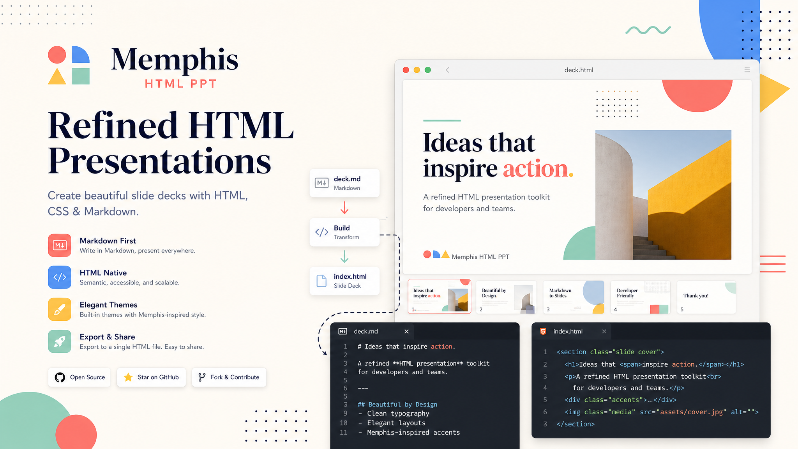

# Memphis HTML PPT

[中文文档](README.zh-CN.md)



Memphis HTML PPT is a lightweight toolkit for turning Markdown files or web pages into a local HTML slide deck with a bold Memphis-inspired visual style.

It is designed for quick presentation prototyping, skill packaging, and visual storytelling experiments where you want a deck-like preview without opening PowerPoint, Keynote, or Google Slides.

## Highlights

- Generate HTML slide decks from local Markdown or remote web pages
- Uses a curated Memphis visual system with bold colors, geometric decoration, and editorial-style layouts
- Includes a template library for cover, narrative, comparison, checklist, timeline, metric, FAQ, and closing slides
- Ships with local packaging scripts for Codex / Claude skill distribution workflows
- Outputs a self-contained HTML preview that can be opened directly in a browser

## Project Status

This repository is currently best described as a practical generator and reusable project template rather than a polished npm package.

- The preview generator is usable now
- The packaging scripts are usable for local bundle generation
- The project includes a minimal `package.json` for Node.js script management

## Preview


## Directory Structure

```text
.
├── assets/                    # Shared CSS and template libraries
├── references/                # Style, workflow, and packaging notes
├── scripts/                   # Preview generation and release scripts
├── SKILL.md                   # Skill definition
├── juejin-skill-ppt.md        # Sample source content
├── juejin-skill-memphis.html  # Example generated preview
└── test-content.md            # Local test content
```

## Requirements

- Node.js 18 or later recommended

The generator uses:

- native `fetch`
- ES module syntax
- filesystem APIs from Node.js

## Quick Start

Generate an HTML preview from a local Markdown file:

```bash
npm run preview -- --input ./test-content.md --output ./preview.html
```

Or run the script directly:

```bash
node scripts/generate-preview.js --input ./test-content.md --output ./preview.html
```

Generate an HTML preview from a web page:

```bash
node scripts/generate-preview.js --input https://example.com/article --output ./preview.html
```

Then open the generated `preview.html` in your browser.

## Available Scripts

### `scripts/generate-preview.js`

Generates a Memphis-style HTML presentation preview.

```bash
node scripts/generate-preview.js --input <url-or-file> --output <html-file>
```

Behavior:

- Accepts local Markdown, local HTML, or remote HTTP/HTTPS URLs
- Parses source sections into slide candidates
- Applies built-in templates from [`assets/template-library.json`](assets/template-library.json)
- Writes the final HTML file to the requested output path

### `scripts/build-release.js`

Builds release bundles under `dist/`.

```bash
npm run build
```

Or:

```bash
node scripts/build-release.js
```

Outputs:

- `dist/codex/memphis-html-ppt`
- `dist/claude/memphis-html-ppt`

### `scripts/publish-local.js`

Copies built bundles into local skill directories:

```bash
npm run publish:local
```

Or:

```bash
node scripts/publish-local.js
```

Targets:

- `~/.codex/skills/memphis-html-ppt`
- `~/.claude/skills/memphis-html-ppt`

## How It Works

The generator follows a simple workflow:

1. Load Markdown, HTML, or a remote page.
2. Extract sections, paragraphs, and bullet points.
3. Map each section to a slide template.
4. Render a themed HTML deck using the shared Memphis stylesheet.

The current implementation prioritizes speed and readability over deep semantic analysis.

## Design Direction

This project intentionally avoids generic corporate slide styling. The visual system emphasizes:

- bright accents
- cutout geometry
- playful asymmetry
- strong title hierarchy
- decorative rhythm with controlled density

For more context, see:

- [`references/memphis-style.md`](references/memphis-style.md)
- [`references/template-catalog.md`](references/template-catalog.md)
- [`references/html-preview-workflow.md`](references/html-preview-workflow.md)

## Limitations

- No npm publishing workflow yet
- No automated test suite yet
- HTML parsing is intentionally lightweight and may not preserve complex article structure
- Long sections are currently compressed into single slides instead of fully paginated overflow slides
- Remote page extraction depends on the raw HTML structure of the target page

## Roadmap Ideas

- Add screenshot-based visual regression checks
- Improve content chunking for long sections
- Support richer article extraction and metadata handling
- Export deck assets or interoperable slide formats

## License

This project is licensed under the MIT License. See the [LICENSE](LICENSE) file for details.
