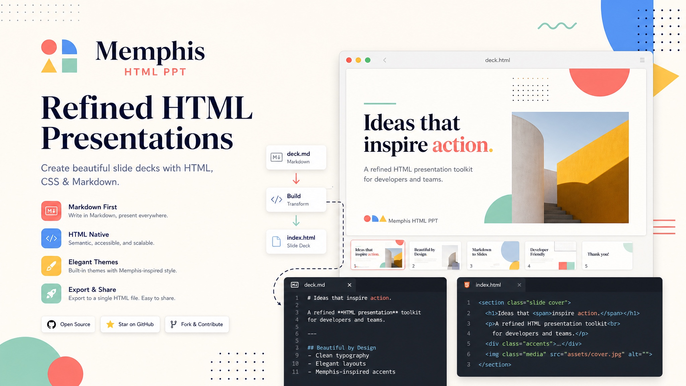
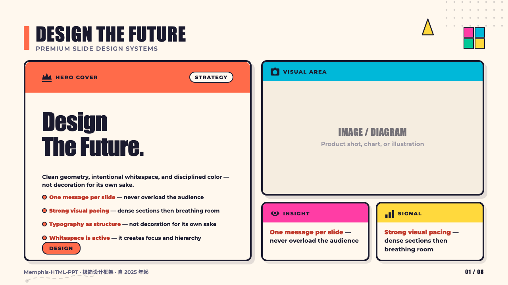
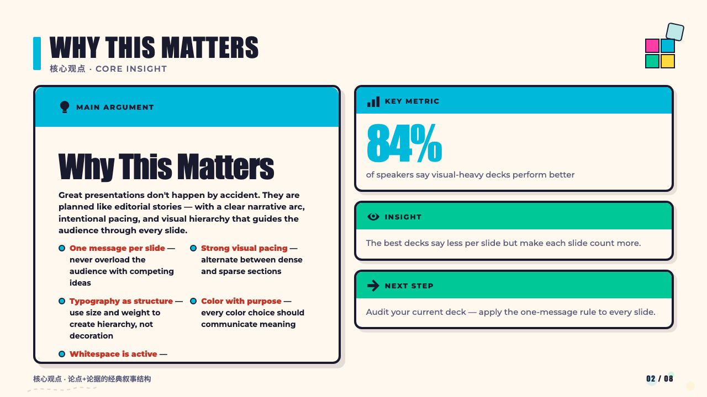
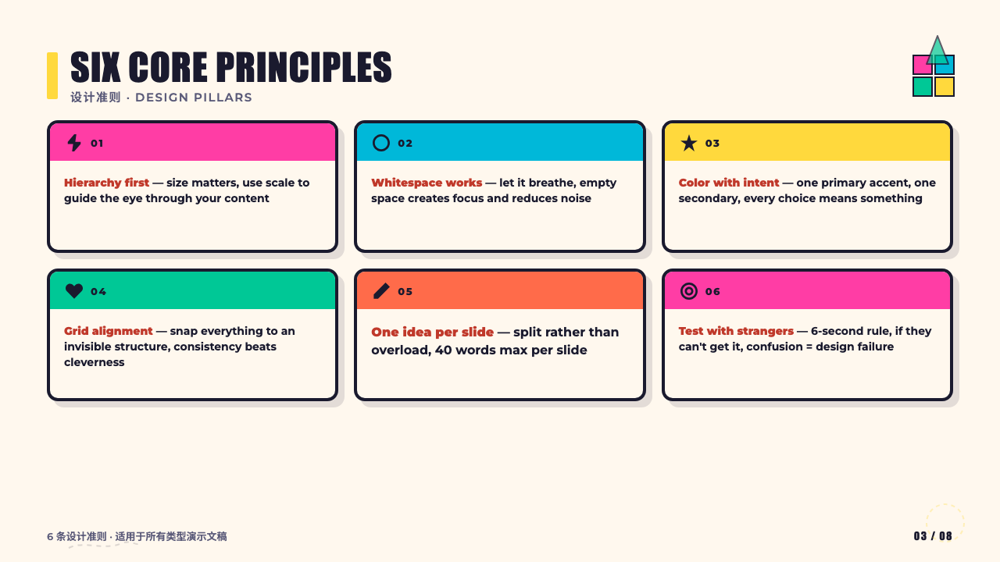
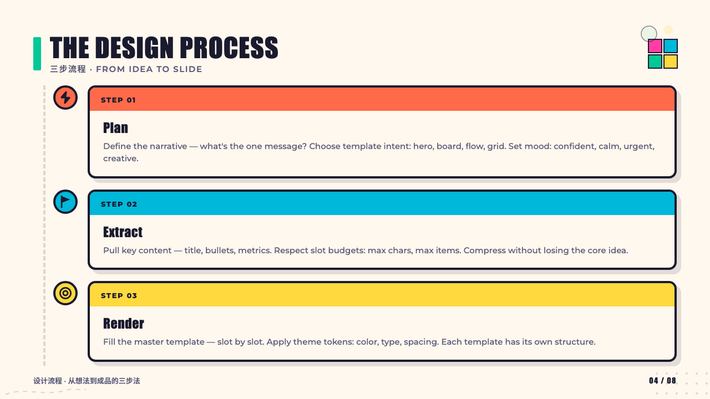
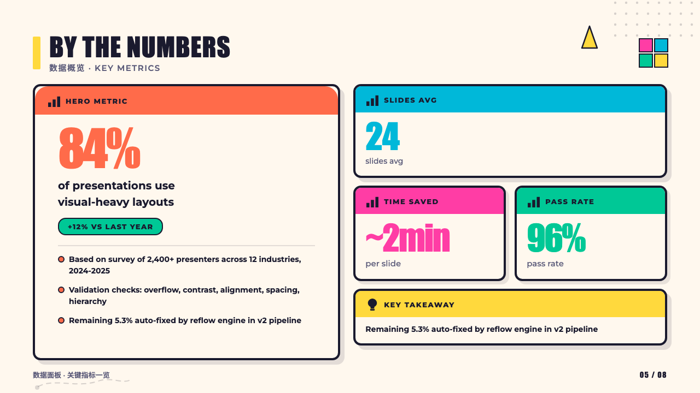
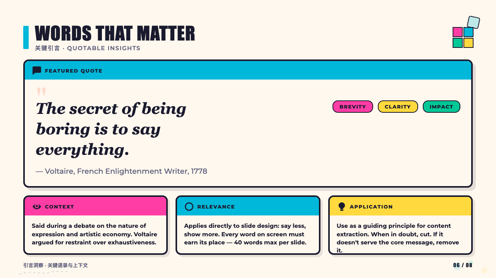
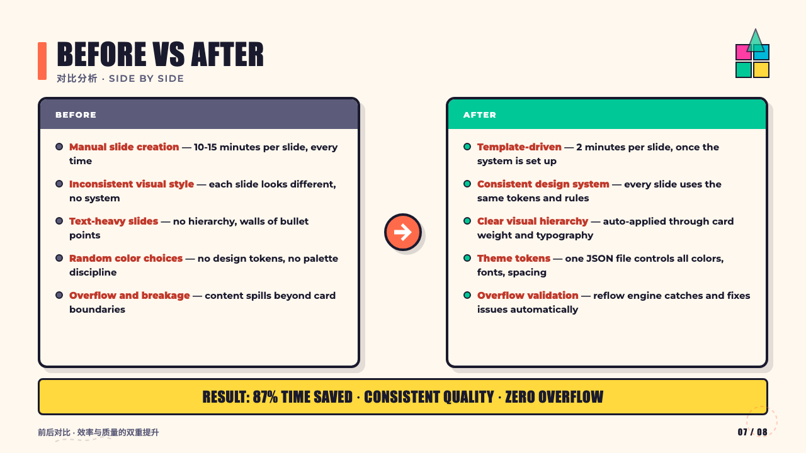
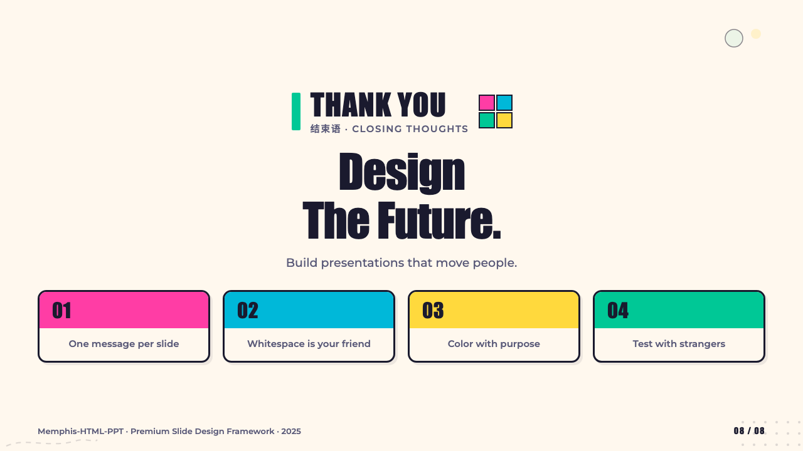

# Memphis HTML PPT

[](LICENSE)
[](https://nodejs.org/)
[](#工作原理)
[](#预览效果)

[English README](README.md)



Memphis HTML PPT 会将 Markdown 文档或网页转换为可直接在浏览器打开的 HTML 演示稿，并采用鲜明的 Memphis 风格视觉设计。

它适合以下场景：

- 快速构建演示稿原型
- 将文章内容转换为“像 PPT 一样”的 HTML 预览
- 作为 Codex / Claude Skill 的可复用模板工程
- 进行带有鲜明视觉风格的信息展示实验

## 项目亮点

- 支持从本地 Markdown 或网页 URL 生成 HTML 幻灯片
- 内置 Memphis 风格视觉系统，强调高饱和色彩、几何装饰和编辑感排版
- 提供多种版式模板，包括封面、叙事、对比、清单、时间线、指标、FAQ、结尾页等
- 附带本地打包脚本，方便产出 Codex / Claude Skill 发布目录
- 输出结果是可直接在浏览器打开的 HTML 文件

## 当前状态

这个仓库是一个可用的生成器加可复用模板工程。

- 预览生成脚本可直接处理本地 Markdown 和远程 URL
- 打包脚本可用于本地生成发布目录
- 当前工作流已经收敛到单一的 adaptive AI 规划链路

- 迁移梳理文档：[`docs/04-adaptive-chain-migration-map.md`](docs/04-adaptive-chain-migration-map.md)
- 内容质量与自动化验证方案：[`docs/05-content-quality-validation-plan.md`](docs/05-content-quality-validation-plan.md)

## 预览效果

下面这组图来自 `assets/readme-preview/demo-adaptive-deck` 的真实 adaptive 生成结果。

<table>
  <tr>
    <td width="25%"></td>
    <td width="25%"></td>
    <td width="25%"></td>
    <td width="25%"></td>
  </tr>
  <tr>
    <td width="25%"></td>
    <td width="25%"></td>
    <td width="25%"></td>
    <td width="25%"></td>
  </tr>
</table>

视觉校验结果：`0` 个 failure，`0` 个 warning。

## 目录结构

```text
.
├── assets/                    # 共享 SVG 模板、样式和演示图
├── references/                # 设计规范、工作流和打包说明
├── scripts/                   # 预览生成、校验和发布脚本
├── SKILL.md                   # Skill 定义文件
├── juejin-skill-ppt.md        # 示例源内容
├── juejin-skill-memphis.html  # 示例生成结果
└── test-content.md            # 本地测试内容
```

## 环境要求

- 推荐 Node.js 18 或更高版本

当前脚本依赖：

- Node.js 原生 `fetch`
- ES Module 语法
- Node.js 文件系统 API

## 快速开始

从本地 Markdown 生成 HTML 预览：

```bash
npm run preview -- --input ./test-content.md --output ./preview.html
```

或者直接执行脚本：

```bash
node scripts/generate-adaptive-preview.js --input ./test-content.md --output ./preview.html --plan-output ./preview.plan.json --source-output ./preview.source.md --source-package-output ./preview.source-package.json
```

从网页生成 HTML 预览：

```bash
node scripts/generate-adaptive-preview.js --input https://example.com/article --output ./preview.html --plan-output ./preview.plan.json --source-output ./preview.source.md --source-package-output ./preview.source-package.json
```

生成新的 adaptive AI 规划版预览：

```bash
npm run preview:adaptive -- --input https://example.com/article --output ./adaptive-preview.html --plan-output ./adaptive-preview.plan.json
```

运行 adaptive 自动校验：

```bash
npm run validate:preview -- --html ./preview.html --plan ./preview.plan.json
```

运行内容质量校验：

```bash
npm run validate:content -- --plan ./preview.plan.json --source-package ./preview.source-package.json --html ./preview.html --out-report ./artifacts/content-quality.json
```

运行 adaptive 视觉回归校验：

```bash
npm run validate:visual -- --html ./preview.html --compare-svg true --out-dir ./artifacts/visual
```

生成的产物目录会包含：

- `deck.html`：最终 HTML 格式 PPT
- `index.html`：视觉校验报告入口
- `visual-summary.json`：结构化校验结果
- 每页的 `html / ref / diff / compare` 图片

生成后，直接用浏览器打开 `preview.html` 即可查看。

## 可用脚本

### `scripts/generate-adaptive-preview.js`

生成 adaptive AI 规划版预览，以及配套的 cleaned markdown、`source package` 和 `deckPlan` JSON。

```bash
node scripts/generate-adaptive-preview.js --input <url-or-markdown-file> --output <html-file> [--plan-output <deck-plan.json>] [--source-output <clean.md>] [--source-package-output <source-package.json>]
```

主要行为：

- 对 URL 先抽取可读 Markdown 原文
- 先生成 cleaned markdown，再抽取 `source package`
- 生成带 `templateId`、`reasoning` 和结构化内容的 `deckPlan`
- 通过 `render-adaptive.js` 渲染为 adaptive HTML Deck
- 同时输出 HTML、可单独校验的 plan JSON，以及 source package JSON

### `scripts/validate-adaptive-preview.js`

校验 adaptive HTML 预览和可选的 `deckPlan` JSON。

```bash
node scripts/validate-adaptive-preview.js --html <preview.html> [--plan <deck-plan.json>] [--min-slides 1] [--strict-fit true]
```

主要行为：

- 检查 adaptive HTML 的 slide wrapper、导航、页码和进度条结构
- 校验 `deckPlan` 元数据、模板 id 和 HTML / plan 的对应关系
- 基于模板 slot 约束输出 overflow、缺字段和匹配不足等问题

### `scripts/validate-content-quality.js`

校验 cleaned markdown / source package / deck plan 的内容质量。

```bash
node scripts/validate-content-quality.js --plan <deck-plan.json> [--source-package <source-package.json>] [--cleaned-markdown <clean.md>] [--html <preview.html>] [--out-report <report.json>]
```

主要行为：

- 检查噪声内容是否仍然残留
- 校验强重点 section 的覆盖率
- 校验 metric / command 是否被合理抽取
- 校验代码资产是否以合适模板呈现
- 校验模板语义是否和 slide content 匹配

### `scripts/build-release.js`

在 `dist/` 下构建发布目录：

```bash
npm run build
```

或者：

```bash
node scripts/build-release.js
```

输出目录：

- `dist/codex/memphis-html-ppt`
- `dist/claude/memphis-html-ppt`

### `scripts/publish-local.js`

将构建产物同步到本地 Skill 目录：

```bash
npm run publish:local
```

或者：

```bash
node scripts/publish-local.js
```

目标位置：

- `~/.codex/skills/memphis-html-ppt`
- `~/.claude/skills/memphis-html-ppt`

## 工作原理

当前生成流程已经统一为：

1. 读取本地 Markdown 或远程网页。
2. 抽取清洗后的源 Markdown。
3. 构建 `source package` 和 `deckPlan`。
4. 渲染 adaptive HTML Deck 并执行校验。

现阶段实现更偏向“快速可用”和“视觉呈现”，不是深度语义理解型排版引擎。

## 设计风格

这个项目刻意避开普通商务风 PPT，更强调：

- 明亮且高对比的配色
- 几何切片和装饰元素
- 带节奏感的不对称布局
- 强烈的标题层级
- 有控制感的视觉活力

更多设计背景可参考：

- [`references/memphis-style.md`](references/memphis-style.md)
- [`references/template-catalog.md`](references/template-catalog.md)
- [`references/html-preview-workflow.md`](references/html-preview-workflow.md)

## 已知限制

- 目前还没有 npm 发布工作流
- 还没有自动化测试
- HTML 解析逻辑目前偏轻量，复杂网页结构保真度有限
- 超长章节目前不会自动拆成多页溢出幻灯片
- 远程网页的提取效果依赖目标页面本身的 HTML 结构

## 后续可扩展方向

- 增加基于截图的视觉回归校验
- 优化长内容拆页能力
- 支持更丰富的网页正文提取与元数据处理
- 支持更多导出格式或与其他演示工具互通

## 开源协议

本项目采用 MIT License，详见 [LICENSE](LICENSE)。
